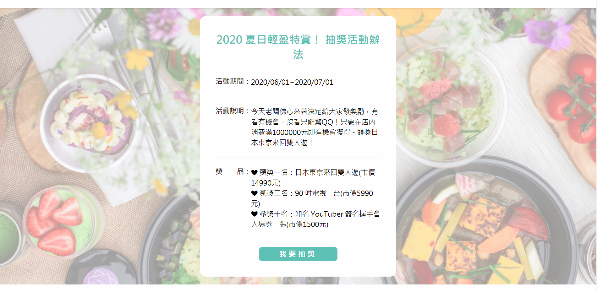

# 咬一口餐廳

主要為使用 Express + Sequlize 所實作的餐廳網站。 
利用 nginx 及 PM2 部署在 AWS EC2 Ubuntu 主機上，並架設到指定網域。

## DEMO 網址：

http://restaurant.yunan.tw/


## 功能：

**後台管理員**

* 餐廳餐點
  * 新增品項
  * 刪除品項
  * 編輯品項

* 抽獎
  * 新增、編輯、刪除獎項資訊

* 常見問題
  * 新增、編輯、刪除常見問題 


```
管理員帳號：admin
管理員密碼：test
```

**前台**

* 購物車及訂單功能
  
  

  

* 抽獎

  

* 查看常見問題

## 架構

**controller：**

* admin： 只要是管理於控制的（例如：新增、編輯、刪除抽獎、菜單、常見問題的後台資料）功能都寫在 admin controller 裡
* main： 首頁
* prize： 抽獎
* menu： 點餐，加入購物車
* cart： 訂單，處理訂單數量更改/ 訂購人資訊
* faq： 常見問題
